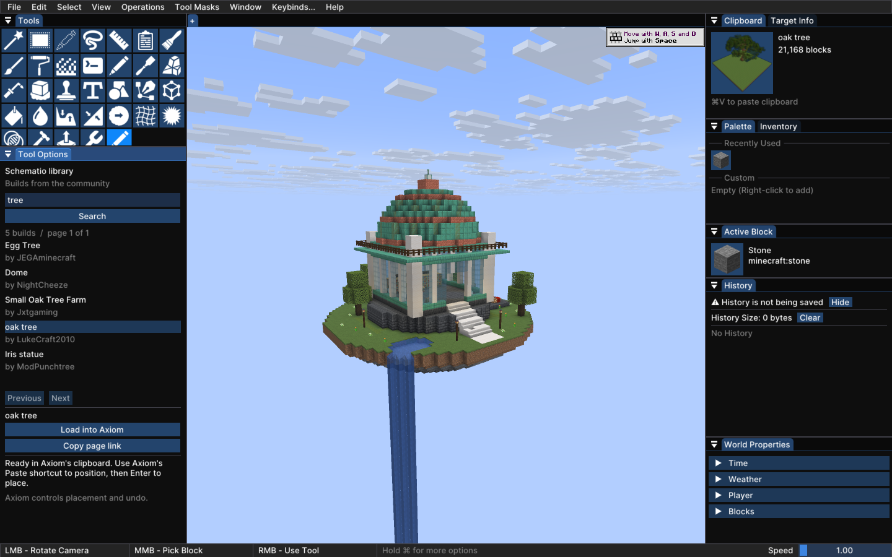
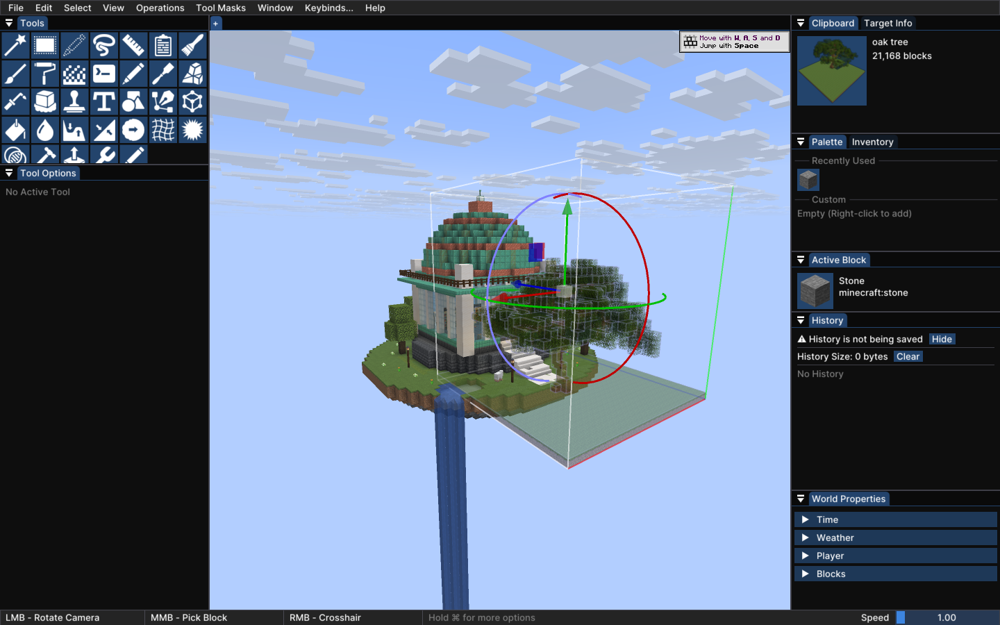
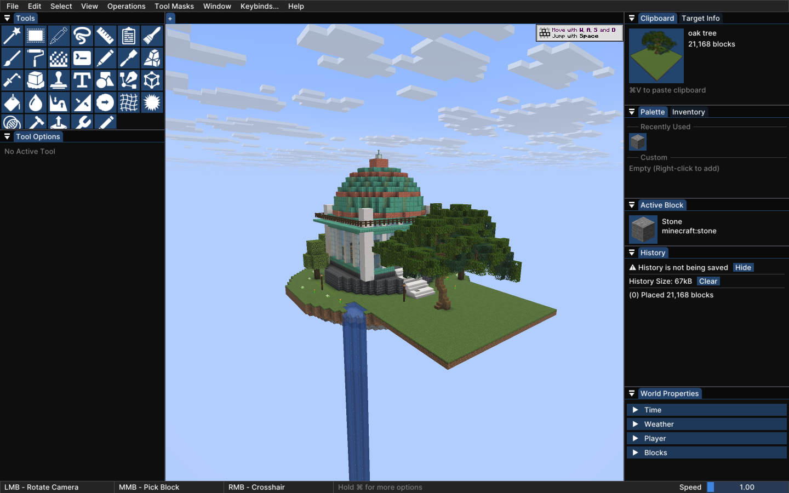

# Schematio inside Axiom

This Minecraft 26.2 proof of concept adds a Schematio tool to Axiom's editor. Search public builds, select one, and click **Load into Axiom**. Axiom then owns the clipboard preview, positioning, transforms, placement and undo.



The add-on uses Axiom's `CustomTool` extension point. It adds no renderer, overlay, input callbacks, mixins or native libraries. Axiom's distributed jar is unchanged. The packaged add-on is about 20 KB; Axiom and Fabric API are separate dependencies.

## Try the Minecraft 26.2 prototype

Build from the repository root with Java 25:

```sh
./gradlew -p axiom-poc build
```

Put `axiom-poc/build/libs/Schematio-Axiom-mc26.2-0.1.0-poc.1.jar` in a Minecraft **26.2** Fabric profile with **Axiom 6.0.5**, Fabric API and Fabric Loader 0.19.3. Open a creative world, open Axiom's editor, and choose the last tool in the default Tools grid. Its tooltip says **Schematio**.

Search for `tree`, select a result, and click **Load into Axiom**. Point at the world and use the Paste shortcut shown by Axiom's clipboard panel. Position the preview and press Enter. Axiom's normal Undo action reverses the placement. The add-on respects Axiom's import permissions and waits until an existing placement is finished or cancelled.

This is a separate experimental add-on in the Connector repository. It demonstrates the integration boundary before incorporation into the regular Connector mod. It is not a published Connector release. [Connector source and releases](https://github.com/Schem-at/SchematioConnector).

## What belongs to each mod

| Schematio add-on | Axiom |
| --- | --- |
| Public search, author names, pagination and page links | Editor layout and input handling |
| Downloading Sponge schematic data from Schematio | Schematic interpretation and block regions |
| Size limits, cancellation and stale-request checks | Clipboard thumbnails and world previews |
| Handing the finished clipboard to Axiom | Placement, transforms, server restrictions and undo |

The HTTP request and schematic decoding run on one lazy worker thread. Results return to the client thread only to update the interface or replace the clipboard. There is no background polling. Before the handoff, the add-on checks the world, clipboard, active placement and import permission again. A cancelled or stale result cannot replace the player's newer clipboard.

Axiom exposes the tool registration API publicly, but its clipboard transfer API is internal. Those calls live in `AxiomClipboardAdapter`; this prototype activates only with Axiom 6.0.5. Without Axiom, or with another Axiom version, it stays inactive.

## Verified behavior and current limits

[The test record](VERIFICATION.md) separates compilation, unit tests, packaged startup and MCInspector checks. It includes frame samples and a paste/undo comparison of actual world blocks.

The prototype browses public builds and imports Sponge v2/v3 schematics. It has no account sign-in, private library, upload flow or bridge to a Schematio server plugin yet. Remote multiplayer has not been tested. It accepts downloads up to 16 MiB, limits NBT allocation accounting to 64 MiB and caps schematic volume at 2 million cells, including air.

Schematics containing entities are rejected because Axiom 6.0.5's schematic loader does not preserve them in its placement entity list. Block entities pass through Axiom's loader, but container contents and complex block entities need dedicated tests before a release. Large-build performance, lower-end hardware and other Axiom versions also need testing.





The imported [oak tree](https://schemat.io/schematics/X2rTZt) is by LukeCraft2010. Screenshots were captured from the packaged prototype in an isolated copy of Copperlight Workshop.

## Development checks

The Gradle task below launches the packaged jar through normal Fabric discovery, including Axiom's nested dependencies:

```sh
./gradlew -p axiom-poc runPocClient -PwithAxiom=true
```

Add `-PinspectorJar=/absolute/path/to/MC-Inspector-mc26.2-0.1.0.jar` to run with MCInspector. `-PpocRunDir=run-test` chooses an isolated game directory. `-PpocWorld=WorldFolderName` opens a world already in that directory. Omitting `-PwithAxiom=true` exercises startup without Axiom.

The Python helpers in `scripts/` are test tools and stay outside the mod jar. They use MCInspector's loopback MCP endpoint on port 38272 by default; set `SCHEMATIO_INSPECTOR_PORT` to change it. The editor input helper calls Axiom's existing GLFW callback methods without replacing handlers or calling ImGui directly.

With the Schematio tool registered and a build already in Axiom's clipboard, `scripts/runtime_checks.py` tests invalid files, cancellation and clipboard replacement against a delayed local HTTP fixture. It restores the original endpoint and clipboard afterwards. `scripts/benchmark.py` samples the idle editor with a populated search and clipboard preview. Both require the disposable test world and completed Axiom onboarding; use them with the MCInspector UI closed.

The integration is based on [AxiomClientAPI](https://github.com/Moulberry/AxiomClientAPI), the [official example](https://github.com/Moulberry/AxiomClientAPIExample), and inspection of Axiom 6.0.5's published Minecraft 26.2 jar. Only the add-on's source is included here.
