# Schematio Connector

Schematio Connector brings your [schemat.io](https://schemat.io) library into Minecraft. Browse a build, load it into Litematica or WorldEdit, and upload your own work from the game.

The Fabric mod provides the browser and preview tools. The Paper plugin connects a server to your Schematio community. Install both to use the mod's interface with the server's WorldEdit clipboard.

<figure markdown="span">
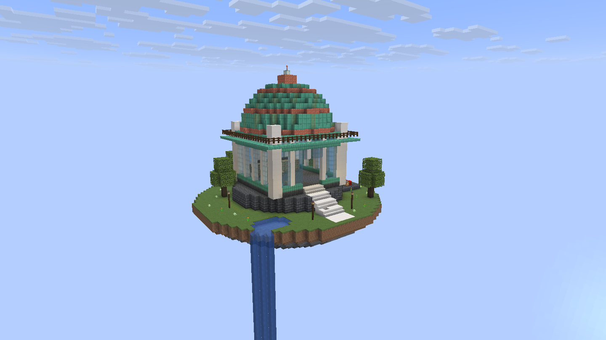
<figcaption>Copperlight Observatory in Minecraft 26.2. The captures below use this same build in a local demonstration setup.</figcaption>
</figure>

[Download the example build](downloads/copperlight-observatory.zip) as a ZIP containing both `.litematic` and `.schem` files.

## Downloads

The files below are the **1.3.3 release candidate**, hosted by Schematio. The [latest published release on GitHub](https://github.com/Schem-at/SchematioConnector/releases/latest) remains available while this candidate is reviewed.

<div data-article-downloads></div>

Choose the Fabric jar for your Minecraft version. A single Paper jar covers Minecraft 1.21.8–1.21.11, 26.1.2, and 26.2. See the [source code and issue tracker on GitHub](https://github.com/Schem-at/SchematioConnector).

## The plugin: Schematio and server WorldEdit

Install the Paper plugin on your server with WorldEdit. Players can download a schematic into their own WorldEdit clipboard, then choose where to paste it. They can also copy a build and upload it to the server's linked Schematio community. Players can use the plugin through commands and Minecraft's native dialogs without installing the client mod.

Put the Connector Paper jar and a compatible WorldEdit plugin jar in `plugins/`, then restart the server. For the tested Minecraft 1.21.x servers running Java 21, use WorldEdit 7.3.19. WorldEdit 7.4.x requires Java 25. Link your community using the setup below.

<figure class="kg" data-static="media/server-workflow-960.svg">
<picture>
<source media="(max-width: 399px)" srcset="media/server-workflow-320.svg">
<source media="(max-width: 599px)" srcset="media/server-workflow-390.svg">
<source media="(max-width: 899px)" srcset="media/server-workflow-720.svg">
</picture>
<figcaption>A download fills your WorldEdit clipboard. Run //paste when you are ready to place the build.</figcaption>
</figure>

Copy a schematic's ID from its Schematio page and run:

```text
/schematio download <schematic-id>
//paste
```

<figure class="minecraft-command-demo">
<video autoplay muted loop playsinline controls preload="metadata" poster="/articles/schematio-connector/media/minecraft-command-720.svg" aria-label="Illustrated Minecraft command typing. Use the controls to pause or replay.">
<source media="(max-width: 599px) and (prefers-reduced-motion: no-preference)" src="media/minecraft-command-320.mp4" type="video/mp4">
<source media="(prefers-reduced-motion: no-preference)" src="media/minecraft-command-720.mp4" type="video/mp4">
</video>
<picture class="minecraft-command-demo__still">
<source media="(prefers-reduced-motion: reduce) and (max-width: 599px)" srcset="media/minecraft-command-320.svg">
<source media="(prefers-reduced-motion: reduce)" srcset="media/minecraft-command-720.svg">
<source media="(max-width: 599px)" srcset="media/minecraft-command-320.svg">
</picture>
<figcaption>An illustrated command example. The commands above are copyable; the in-game screenshots below show the working tools.</figcaption>
</figure>

To upload a build, mark its corners with WorldEdit's selection tool, run `//copy`, then `/schematio upload`. Follow the prompts to name the schematic and finish the upload. The community token gives the plugin access to the community; the player remains credited as the author.

The server's usual WorldEdit permissions still apply. `schematio.upload` defaults to operators; server owners can grant it through their permissions plugin. The [command and permission reference](https://github.com/Schem-at/SchematioConnector#commands) covers the remaining controls.

## Community owners: link your server

Open **Plugin API Tokens** in your community's settings on Schematio. You need to be a community administrator. Choose **Create Plugin Token**, give it a name that identifies the server, and select **Full Access** for uploads and downloads. Use a narrower scope if the server only needs one direction.

<figure class="kg" data-static="media/community-link-960.svg">
<picture>
<source media="(max-width: 399px)" srcset="media/community-link-320.svg">
<source media="(max-width: 599px)" srcset="media/community-link-390.svg">
<source media="(max-width: 899px)" srcset="media/community-link-720.svg">
</picture>
<figcaption>Create the token in community settings and configure it once on the server.</figcaption>
</figure>

Copy the generated token and enter this in the server console:

```text
schematio settoken <your-community-token>
```

Keep the token in the server configuration. Players do not need a copy. Give each server its own token so you can revoke one from community settings without disconnecting the others.

Run `/schematio info` to check the plugin's setup. Ask players using the bridge to link their Minecraft account to their Schematio profile. Rejoin after configuring or replacing the token so the mod can check the server's identity again.

## The mod: local Litematica and WorldEdit

Install [Fabric Loader](https://fabricmc.net/use/installer/), then put the Connector jar for your Minecraft version in `mods/` with [Fabric API](https://modrinth.com/mod/fabric-api) and [Fabric Language Kotlin](https://modrinth.com/mod/fabric-language-kotlin). Connector 1.3.3 requires Fabric Language Kotlin 1.13.12 or later. The panel interface is included.

Join a world and press **K** to open the overlay. Choose **Schematio → Browse**, or run `/schematio`. Your Minecraft session is used to sign in to Schematio. Open a schematic to see its preview, description, authors, and download actions. **Save to disk** works without either building tool installed.

<figure class="kg" data-static="media/local-tools-960.svg">
<picture>
<source media="(max-width: 399px)" srcset="media/local-tools-320.svg">
<source media="(max-width: 599px)" srcset="media/local-tools-390.svg">
<source media="(max-width: 899px)" srcset="media/local-tools-720.svg">
</picture>
<figcaption>Litematica creates a client placement. Local WorldEdit operates in your singleplayer world or the world you host over LAN.</figcaption>
</figure>

For Litematica, install [Litematica](https://modrinth.com/mod/litematica) and [MaLiLib](https://modrinth.com/mod/malilib) for your Minecraft version. Click **Load into Litematica** on a schematic. Connector downloads the Litematica format and creates a placement at your position. Use Litematica's placement controls to move or rotate it, then build against the hologram. This works in singleplayer and multiplayer.

<figure markdown="span">
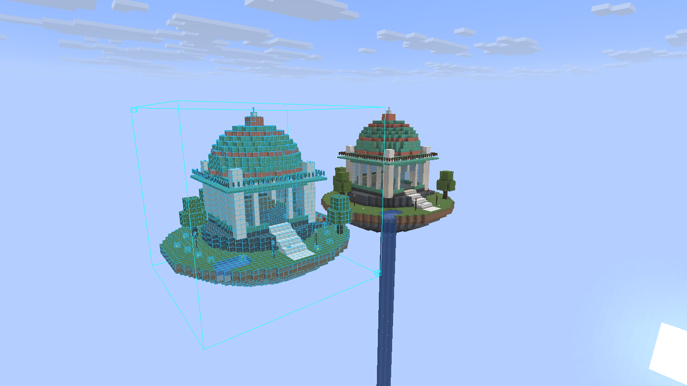
<figcaption>The placement on the left came from Load into Litematica. The solid build on the right was pasted with WorldEdit.</figcaption>
</figure>

For a local WorldEdit clipboard, install the [WorldEdit Fabric mod](https://modrinth.com/plugin/worldedit) for your Minecraft version. In singleplayer, or when hosting a LAN world, the schematic's details offer **To WorldEdit clipboard**. Run a WorldEdit command such as `//pos1` once to create your session, then click the clipboard action and run `//paste`. To upload from that clipboard, select your build and run `//copy` before opening **Schematio → Upload**. Local clipboard access requires the integrated server running in your game; on a dedicated server, use the plugin bridge described below.

<figure markdown="span">
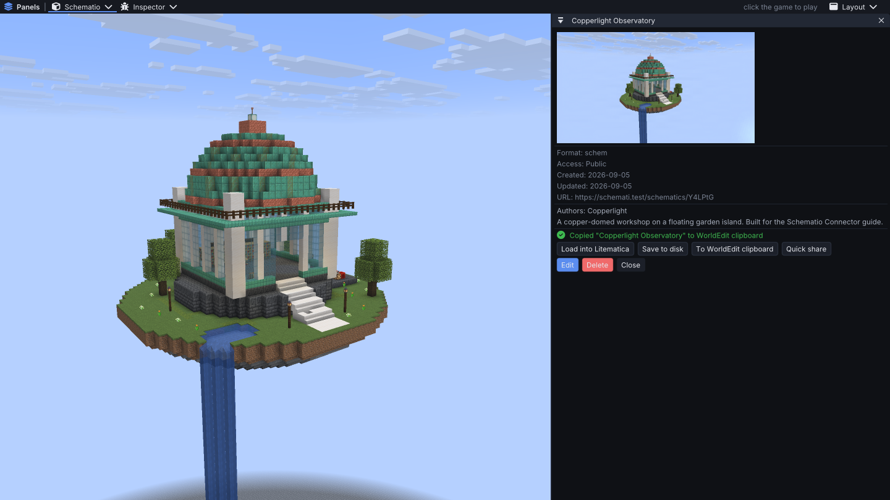
<figcaption>To WorldEdit clipboard loads the integrated server's clipboard. The green message confirms the copy; //paste places it.</figcaption>
</figure>

The upload wizard also accepts local files and Litematica selections or placements. Fill in the name, description, visibility, tags, and co-authors. Use **Compose preview** to frame the schematic before uploading: orbit the model, pan, zoom, choose a camera preset, and capture a PNG.

<figure markdown="span">
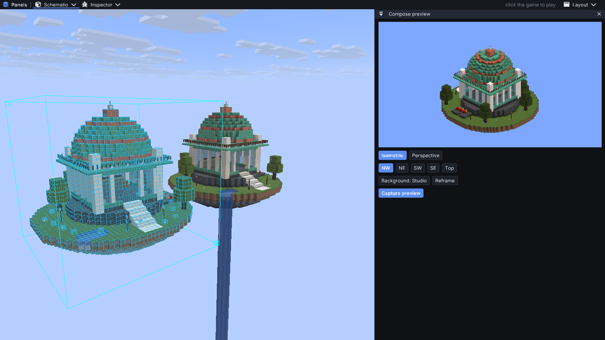
<figcaption>The preview composer renders the schematic inside Minecraft. Here the isometric view frames the whole island without the waterfall flowing in the live world.</figcaption>
</figure>

## The bridge: your mod detects the server

When you join a Paper server running Connector, the mod and plugin detect one another automatically. The plugin supplies the linked community's signed identity. The mod verifies it through Schematio before enabling the advertised server actions. Your client never needs the community's token.

<figure class="kg" data-static="media/bridge-detection-960.svg">
<picture>
<source media="(max-width: 399px)" srcset="media/bridge-detection-320.svg">
<source media="(max-width: 599px)" srcset="media/bridge-detection-390.svg">
<source media="(max-width: 899px)" srcset="media/bridge-detection-720.svg">
</picture>
<figcaption>Joining triggers detection and identity verification. A verified connection enables the server clipboard tools.</figcaption>
</figure>

With the community connection verified and WorldEdit available, a schematic's details show **Load on server**. Click it to have the plugin fetch the schematic into your server-side WorldEdit clipboard. Access is checked against your linked Schematio account. Run `//paste` to place it.

<figure markdown="span">
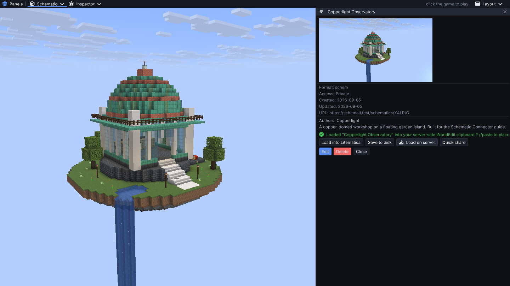
<figcaption>The green message confirms the completed server load. The mod sends the request; the plugin downloads the file and fills WorldEdit's clipboard.</figcaption>
</figure>

For the reverse trip, select and copy a build with WorldEdit, then choose **Schematio → Upload clipboard to server** in the overlay. The plugin uploads your clipboard to Schematio as a draft. The mod checks that the draft belongs to your account and opens it for you to finish. Add its details and choose its visibility before saving.

<figure markdown="span">
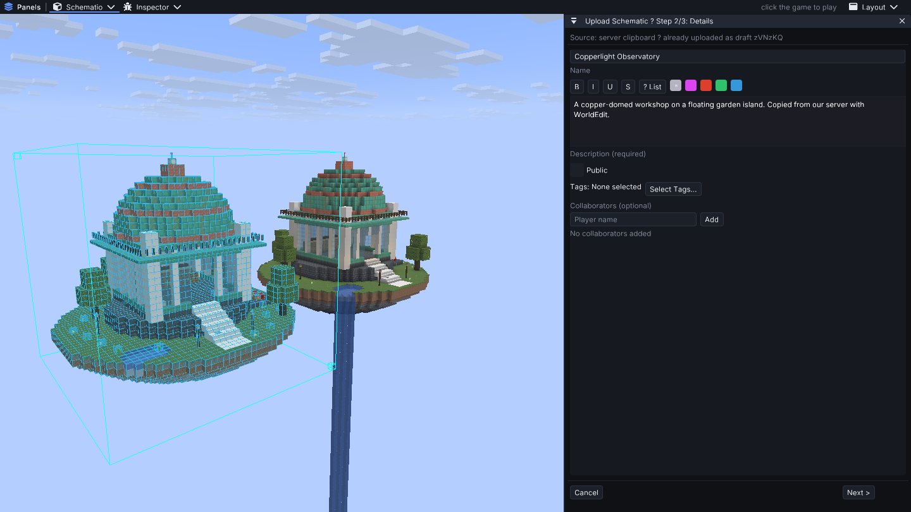
<figcaption>The server clipboard arrives as a draft for the player to complete in the mod.</figcaption>
</figure>

Server owners control these bridge actions with `schematio.clipboard.load` and `schematio.clipboard.upload`; both default to allowed. A failed identity check, unavailable WorldEdit, or denied permission prevents the corresponding action. The Fabric server mod has its own server commands; this automatic plugin bridge uses Paper.

## Troubleshooting

If the mod fails to load, match the Minecraft version in the jar's filename and update Fabric API and Fabric Language Kotlin. Check that Litematica and MaLiLib also match your game version.

If **Load on server** is missing, check that the Paper plugin and WorldEdit started, the community token is configured, and the server identity check succeeded. Rejoin after replacing a token. A denied download can also mean your Minecraft account is not linked to Schematio, or that the schematic is private to someone else.

Client settings let you disable requests from the server to open Schematio windows. This is useful if you prefer to open the overlay yourself.

Report problems in the [GitHub issue tracker](https://github.com/Schem-at/SchematioConnector/issues). Include your Minecraft and Connector versions, whether you use the mod or plugin, and the steps that failed. Remove tokens and account credentials from logs before attaching them.
