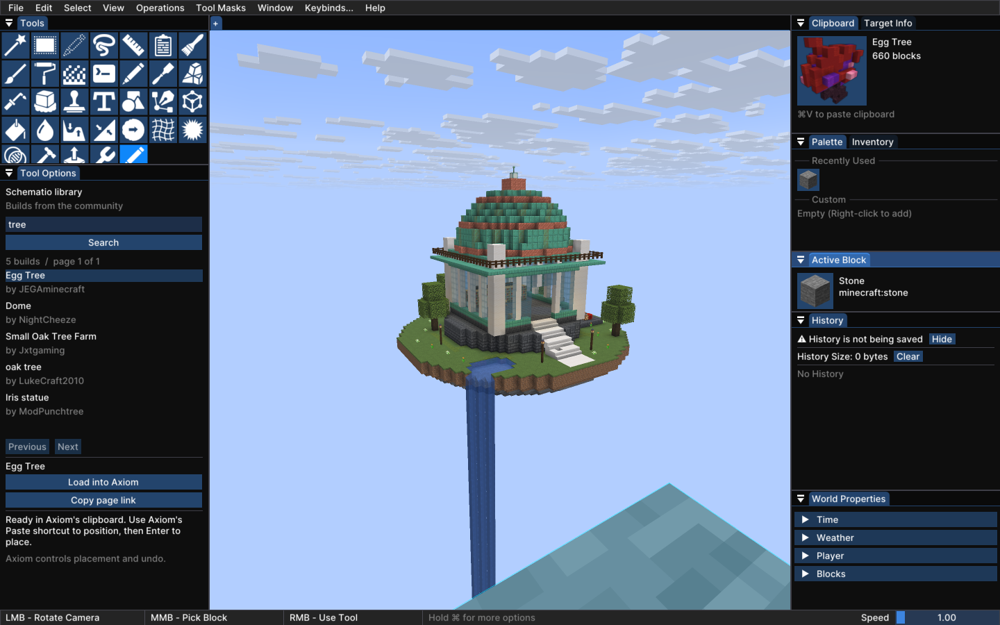
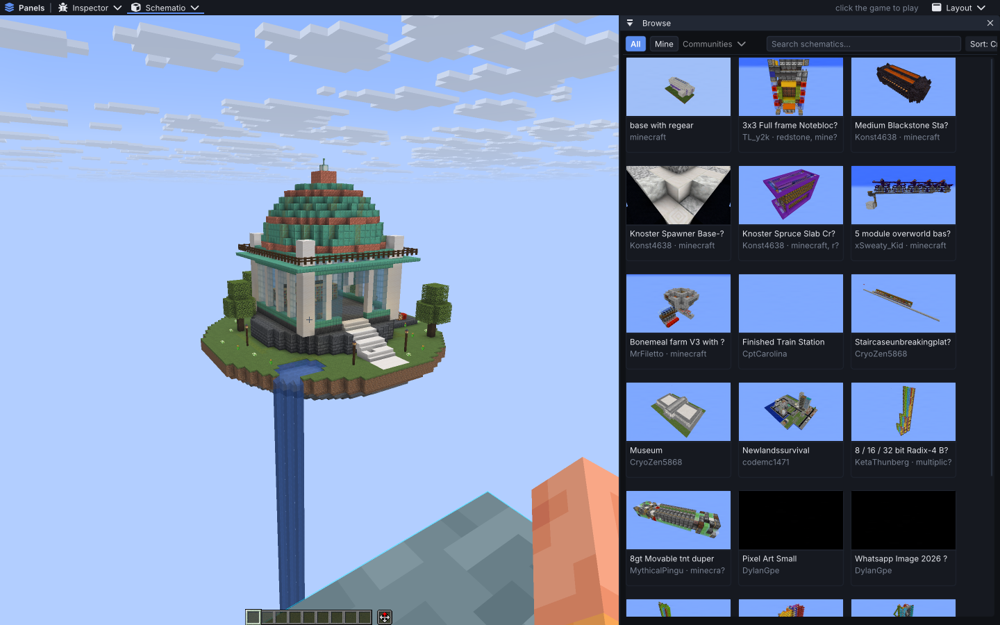
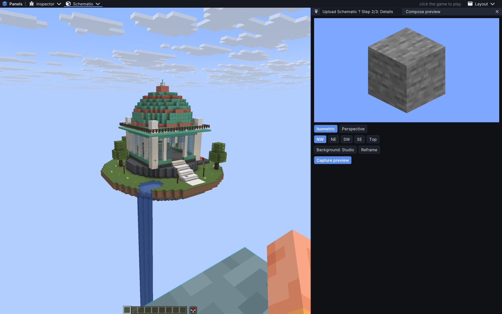

# Connector editor integration

This records the initial 26.2 integration checks. See [release 1.4.0](release-1.4.0.md) for the later six-version matrix.

Connector now uses the existing Axiom tool inside the full mod on Minecraft 26.2 with Axiom 6.0.5. Search and downloads use Connector's shared API, authentication and cache services. Axiom continues to own its interface, clipboard preview, placement and undo. Its jar is a compile-only dependency and is not included in Connector.

## Changes

Thumbnail requests wait in a queue of at most 32 items, with two downloads/decodes active at once. Requests that are no longer visible expire. The cache holds up to 128 textures; failed requests can retry after 30 seconds. Downloads stop at 5 MiB, and decoded images are checked against a four-million-pixel limit before native allocation. Texture uploads have a two-image cap and a cooperative two-millisecond budget per client tick.

The preview composer decodes schematic data on an IO worker. It resolves Minecraft block states and builds geometry across later frames, with two-millisecond cooperative budgets. Model and registry access stays on the client thread. Closing or replacing the composer cancels decoding, drops pending geometry and releases the offscreen target. Camera changes reuse the completed mesh. Snapshot block entities are enumerated directly instead of scanning every block for each frame.

Imports capture their destination before downloading and check it again before committing. Cancellation, a world change, a changed WorldEdit clipboard, or a changed Litematica selection/transform rejects the late result. WorldEdit decoding uses one worker and one waiting slot. The bridge supports WorldEdit 7.4's instance adapter as well as the earlier static adapter. Local downloads use unique names and an atomic move, preserving existing files.

The upload wizard captures its source once. Preview and submission use those same bytes until the player chooses **Refresh source**. Metadata survives editor handoffs, and reopening an already-open wizard keeps the form. Litematica sources use stable placement IDs, so removing a placement cannot silently substitute a different build with the same name. Exports serialize the loaded schematic, including unsaved edits, rather than rereading an older backing file.

Panel-lib 0.1.2 preserves GLFW callbacks and ImGui contexts, releases captured input, and suspends its overlay while Axiom is active. Its panel-close callback lets Connector release work when panels close through the toolbar, title bar or Escape.

## Build and unit tests

All six Fabric targets built and passed 52 tests each: Minecraft 1.21.8, 1.21.9, 1.21.10, 1.21.11, 26.1 and 26.2. Core passed 629 tests. Panel-lib built the same six targets and passed 12 tests per target. The standalone Axiom proof of concept also builds and passes its six tests.

These results establish compilation and automated test coverage. Packaged gameplay for this change was tested on Minecraft 26.2 only.

```sh
# In panel-lib, revision 477100f6fce1ca71f79656f5f51ec3173a04aa54:
./gradlew build publishToMavenLocal

# In SchematioConnector:
./gradlew :core:test :fabric:buildAllVersions
./gradlew -p axiom-poc build
```

Connector's build and release workflows prepare the panel-lib revision pinned in `gradle.properties`. This avoids requiring an unpublished Maven artifact on a clean CI runner. The mod includes panel-lib as a nested jar; players do not need to install the library separately.

## Packaged in-game checks

The test client used Minecraft 26.2, unchanged Axiom 6.0.5, WorldEdit 7.4.5, the pinned Litematica/MaLiLib versions and MCInspector. Checks ran in a disposable copy of Copperlight Workshop on an Apple M2 Max with a 3 GiB Java heap.

- The Axiom tool searched the live Schematio service and loaded Egg Tree into Axiom's native clipboard through Connector's shared service.
- Four round trips between Axiom and Connector preserved the GLFW monitor/cursor-enter callback addresses and restored each editor's viewport dimensions.
- A delayed Axiom fixture request was cancelled without changing the clipboard. Replacing the clipboard during another request rejected the late result.
- WorldEdit loaded a valid fixture, then rejected a request whose captured clipboard had changed. The replacement clipboard remained intact.
- Litematica loaded a fixture, rejected imports after selection/position changes, and refused to substitute another same-name placement for a removed upload source.
- The composer captured a 52,167-byte PNG. Editing the original schematic file afterwards did not change the wizard's frozen bytes or its regenerated preview. Refresh cleared the bytes and preview; closing the composer released its source, preparation state, job and render target.

A synthetic 96 × 96 × 96 solid schematic (884,736 cells) opened in 1.11 ms and completed preview preparation in 4.43 seconds with background FPS throttling disabled. Cancelling an earlier attempt released its state. The budgets are cooperative: one native parse, block operation or layer finalization can exceed them. The recorded Minecraft frame timer samples are diagnostic measurements, not a GPU or end-to-end frame-latency benchmark.

A second packaged startup omitted Axiom, Litematica and WorldEdit. Connector correctly reported all three integrations unavailable, while browsing and the native schematic preview still worked.

The offline test identity cannot authenticate uploads. No schematic was uploaded to the website during these tests. The tests exercise preview capture and source reuse; they do not establish a successful production upload.







## Repeat the runtime checks

```sh
./gradlew :fabric:26.2:runIntegrationClient \
  -PwithAxiom=true -PwithLitematica=true \
  -PworldEditJar=/absolute/path/to/worldedit-mod-7.4.5.jar \
  -PinspectorJar=/absolute/path/to/MC-Inspector-mc26.2-0.1.0.jar \
  -PintegrationWorld=CopperlightWorkshop

python3 axiom-poc/scripts/connector_checks.py
python3 axiom-poc/scripts/runtime_checks.py
python3 axiom-poc/scripts/destination_checks.py
python3 axiom-poc/scripts/preview_budget.py
```

Use a disposable world. The destination checks create Litematica placements and replace the local WorldEdit clipboard. The Axiom delayed-request checks restore the original API service and clipboard. Set `SCHEMATIO_INSPECTOR_PORT` to the port printed by MCInspector (the helpers default to 38272). For an editor-free run, omit the optional mod flags and run `without_editor_checks.py`. Scripts write fresh evidence under `axiom-poc/build/evidence`; this document's recorded results are under `docs/editor-integration-evidence`.

Axiom integration remains restricted to its verified Minecraft 26.2/Axiom 6.0.5 contract. Unsupported combinations retain Connector's normal interface. The prototype still rejects entity-bearing schematics because its current Axiom adapter does not preserve entities. The native clipboard handoff uses Axiom internals, so a future Axiom update needs another compatibility check.
